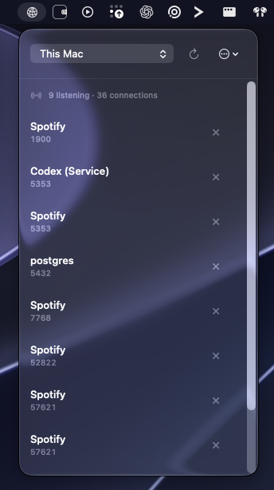
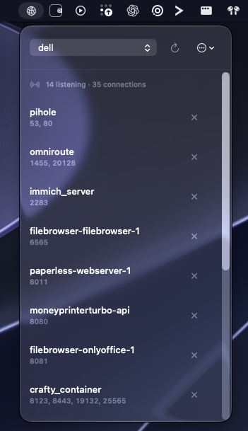

# Porto

Porto is a macOS 26+ menu-bar utility for inspecting network listeners and
active connections on This Mac or one selected Linux host.

<p align="center">
  
  
</p>
<p align="center"><em>Porto's menu-bar popover on This Mac and a remote Linux profile.</em></p>

## Highlights

- View TCP/UDP listeners first, with active connections in a collapsed section.
- Inspect This Mac with `/usr/sbin/lsof` or one opt-in Linux profile over SSH.
- Stop eligible processes with validated identity checks, SIGTERM first, and a
  separate confirmed Force Kill action.
- Stay menu-bar-only: no Dock icon or main window; Settings is a native window.

## Download

[Download the latest release](https://github.com/wehyn/porto/releases/latest)

Releases are unsigned and unnotarized developer builds. Verify the published
SHA-256 checksum. On first launch, macOS may require **System Settings →
Privacy & Security → Open Anyway**.

Release builds periodically check the stable HTTPS Sparkle feed at
<https://github.com/wehyn/porto/releases/latest/download/appcast.xml>. Sparkle
uses signed feed and archive metadata for update verification, while its
standard UI asks before downloading and installing an update. You can also
choose **Check for Updates…** from Porto's menu-bar menu. If the feed is
temporarily unavailable, download the latest release manually from GitHub and
follow the Gatekeeper guidance above.

The first Sparkle-enabled bridge is Porto 1.0.2. Existing Porto 1.0.1
installations need a one-time manual installation of that bridge release before
they can receive later updates; Porto 1.0.1 has no updater code. Sparkle
archive signing is separate from Apple's code signing and notarization: Porto
releases remain unsigned and unnotarized developer builds.

## Build from source

Requirements: macOS 26+, Xcode 26, and XcodeGen 2.46.0 or compatible.

```sh
./scripts/ci.sh
```

To create a universal unsigned Release ZIP locally:

```sh
./scripts/package-unsigned.sh
shasum -a 256 -c dist/Porto-*.sha256
```

The generated Xcode project, build products, and `dist/` output are ignored by
Git. See [CONTRIBUTING.md](CONTRIBUTING.md) for the development contract.

## Remote profiles

Porto starts on **This Mac**. Add and enable a profile in Settings, then select
it from the menu-bar popover. Runtime connections use direct, noninteractive
SSH to the saved host and a fixed, bounded Linux `ss` command; SSH config is
used only to discover importable profiles. See the
[remote profile specification](docs/09-13-2026-porto-manual-remote-server-profiles-spec.md)
for the full contract.

## Safety boundaries

- Local scans use the system `/usr/sbin/lsof` directly.
- Remote commands do not interpolate display text or UI input.
- Process, socket, and container identity are revalidated immediately before
  signaling.
- Porto does not install privileged helpers, use `sudo`, persist raw scan data,
  or collect telemetry.

## Project policies

[MIT License](LICENSE) · [Contributing](CONTRIBUTING.md) ·
[Security policy](SECURITY.md)
